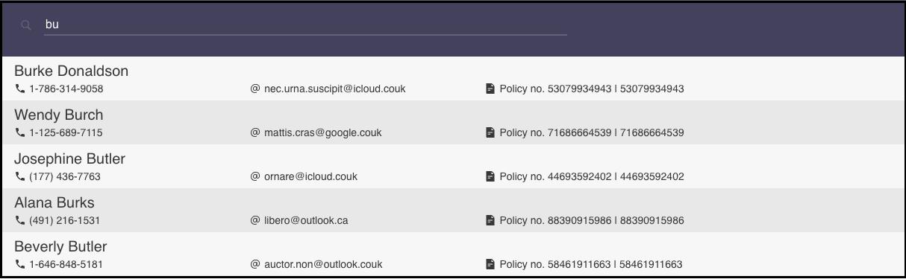

# Interactive type-ahead search

A responsive and interactive type-ahead search component

## Screenshot



### Prerequisites

- npm

  ```sh
  npm install npm@latest -g
  ```

- pnpm

  ```sh
  npm install -g pnpm
  ```

### Installation

1. #### Clone the repo

   ```sh
   git clone https://github.com/merve/type-ahead-search
   ```

2. #### Install NPM packages

   ```sh
   pnpm install
   ```

3. #### Develop

   Runs the app in the development mode.

   ```js
   pnpm dev
   ```

4. #### Test

   Launches the test runner in the interactive watch mode.
   See the section about running tests for more information.

   ```js
   pnpm test
   ```

### Contributing

Pull requests are welcome. For major changes, please open an issue first to discuss what you would like to change.

Please make sure to update tests as appropriate.

### License

[MIT](https://choosealicense.com/licenses/mit/)
